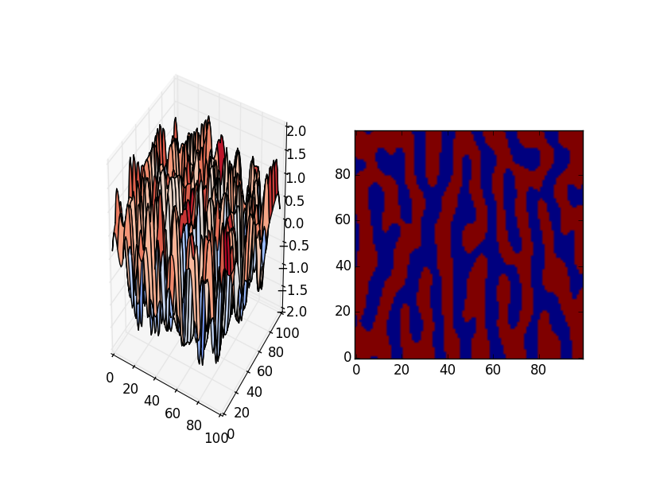

OcellatedLizard
====

# Description
チューリングパターンを生成するプログラム

# Requirement
- Python 2.7.x
- numpy

# Usage
## アプリの起動  
`$ python main.py`

# Install
以下のコマンドで任意のディレクトリに clone してください。  
`$ git clone git@github.com:matsu490/OcellatedLizard.git`  
または任意のディレクトリに ZIP ファイルをダウンロードして解凍してください。

# References
1. [【生物物理学】トカゲの皮膚の模様が形成される過程](http://www.natureasia.com/ja-jp/nature/pr-highlights/11814?utm_source=Twitter&utm_medium=Social&utm_campaign=NatureJapan "【生物物理学】トカゲの皮膚の模様が形成される過程")
2. [【WebGL】模様の生成](https://www.youtube.com/watch?v=f3pmg5v0E7w "【WebGL】模様の生成")
3. [シマウマの縞の謎を解く](http://www.fbs.osaka-u.ac.jp/labs/skondo/saibokogaku/enigma%20of%20zebra.html "シマウマの縞の謎を解く")
4. [チューリングモデルによる模様生成](http://www.usamimi.info/~ide/programe/turingmodel/#index-CA-simulation "チューリングモデルによる模様生成")

# Licence
Copyright (c) 2017 matsu490  
Released under the MIT license  
https://github.com/matsu490/MNISTer/blob/master/LICENSE.txt  

# Author
[matsu490](https://github.com/matsu490)
